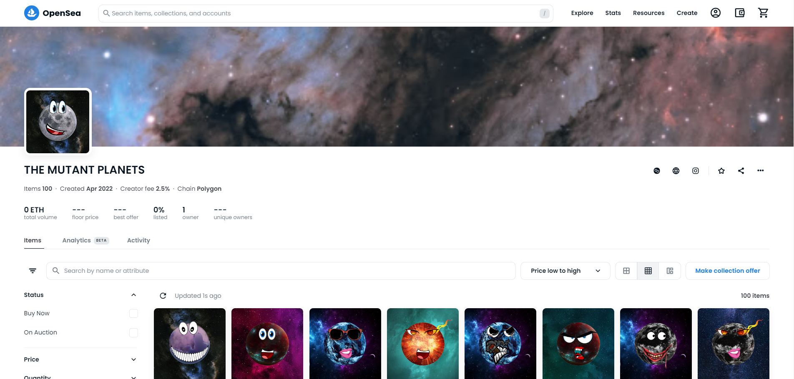

# Deployment of NFT on Open Sea & Website

## 🛣️ Roadmap

- ### Blockchain
        We will be hosting our NFT’s on a secured blockchain through which we will store our
        metadata and NFT’s in a secure decentralized environment and from there we will mint
        those NFT’s for sale purpose on Open Sea platform.

- ### Generating and Selling NFT's
        We have created a code for generation of out NFT’s and we will be uploading the files and
        metadata of those NFT’s on a secure API platform called as NFT Port. We will be
        uploading and minting the NFT’s from our code itself and we will provide the metadata
        with various traits and a specific DNA address of each NFT’s

- ### Promotion
        We will be promoting our NFT’s on various social media handles and on our Discord
        network. As selling NFT’s requires a great amount of connect among the audience we try
        to gather as much audience as we can to get known in the Metaverse and among the Open
        Sea creators.

 

## 👀 Screenshots
- ### Website

 

- ### Open Sea

 

## 🔗 Links

&nbsp&nbsp&nbsp
&nbsp&nbsp&nbsp  

 

## ✍️ Authors

- [Himanshu Agarwal](https://github.com/himanshu-03)
- [Mahima Churi](https://github.com/Mahitej28)
- [Naman Agarwal](https://github.com/namanagarwal3112)
- [Vinit Agarwal](https://github.com/Vinwinit)
 

## 📌 To use this code:

- Clone this repo or download the latest release zip file.
- Unzip, if needed, and open the folder in VS Code.
- From the terminal type:
    `npm install`
- Copy your image layers into the `layer` folder.
- Use the `src/config.js` file to set up your layers and NFT information.
 

 

## 🪪 License
This project follows the [MIT LICENSE](https://choosealicense.com/licenses/mit/).

 

<h3> Connect with me
</h3> 

     &nbsp&nbsp&nbsp
     &nbsp&nbsp&nbsp
     &nbsp&nbsp&nbsp
     &nbsp&nbsp&nbsp
    &nbsp&nbsp&nbsp

(<a href="#top">Back to top</a>)

 

